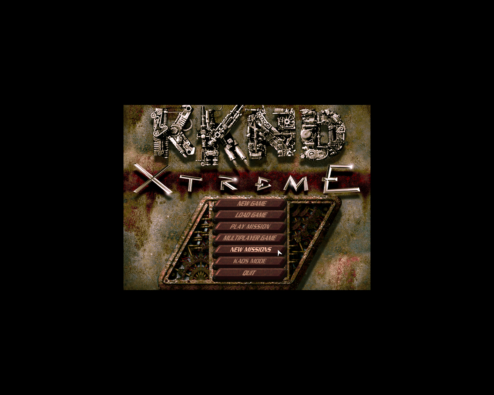
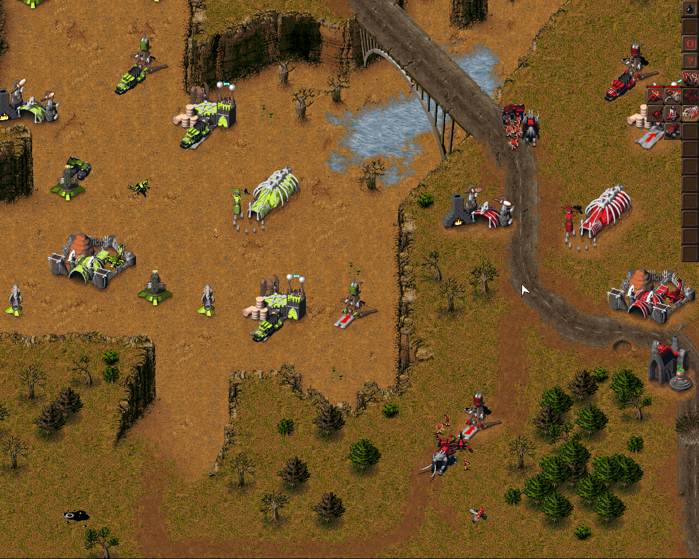

# OpenKKND (HD support)
Krush Kill 'N Destroy Xtreme remake based on original exe decompilation.
All features are working except multiplayer which is not tested.

- `master` branch — original game
- `hd_resolution` branch — HD resolution supported game

## Screenshots




### 🖥️ Supported Resolutions

The engine now supports any custom resolution.

# Build

Clone the repository and checkout the desired branch:

```sh
git clone <repo_url>
git checkout master
```

For HD resolution support use `hd_resolution` branch instead:

```sh
git checkout hd_resolution
```

# HD Resolution

Create `config.txt` in the game folder (same directory as `OpenKKND` executable) with any of the following options:

| Option | Description |
|---|---|
| `vga_resolution_width` | Resolution width |
| `vga_resolution_height` | Resolution height |
| `vga_fullscreen` | Fullscreen mode (1 = fullscreen, 0 = window mode) |

Example `config.txt`:

```
vga_resolution_width=1280
vga_resolution_height=1024
vga_fullscreen=1
```

## Windows
1. Install & configure vcpkg (https://github.com/Microsoft/vcpkg)
2. Make sure VCPKG_ROOT env variable is set to vcpkg folder
3. Make sure dumpbin.exe (part of the Visual Studio installation) is on the PATH (windows-only) to copy dependant libraries dlls via applocal.ps1
4. Install sdl2 with vcpkg (vcpkg install sdl2:x86-windows)
5. Set project output to your KKnD installation folder
6. Build using any CMake-compatible IDE or command line (Visual Studio will do)
7. Run

## Linux

### Build SDL2 (32-bit)
```sh
curl -L https://github.com/libsdl-org/SDL/releases/download/release-2.32.10/SDL2-2.32.10.tar.gz -o /tmp/SDL2-2.32.10.tar.gz
tar -xzf /tmp/SDL2-2.32.10.tar.gz -C /tmp
mkdir -p /tmp/SDL2-build && cd /tmp/SDL2-build
CFLAGS=-m32 CXXFLAGS=-m32 LDFLAGS=-m32 ../SDL2-2.32.10/configure --prefix=$HOME/.local/SDL2-install --libdir=$HOME/.local/SDL2-install/lib --host=i686-linux-gnu
make -j$(nproc)
make install
cd $HOME/.local/SDL2-install/lib && ln -sf libSDL2-2.0.so.0 libSDL2-2.0.so
```

### Build project
```sh
mkdir -p build && cd build
cmake .. -DCMAKE_BUILD_TYPE=Debug -DSDL2_CUSTOM_PREFIX=$HOME/.local/SDL2-install
cmake --build . -j$(nproc)
cd ../bin && ./OpenKKND
```

## 🚀 Purpose

The goal of this repository is to modernize the original game experience by:

* Enabling higher resolutions
* Fixing UI issues that appear at larger screen sizes
* Preserving original gameplay and compatibility
* Keeping engine modifications lightweight and maintainable
