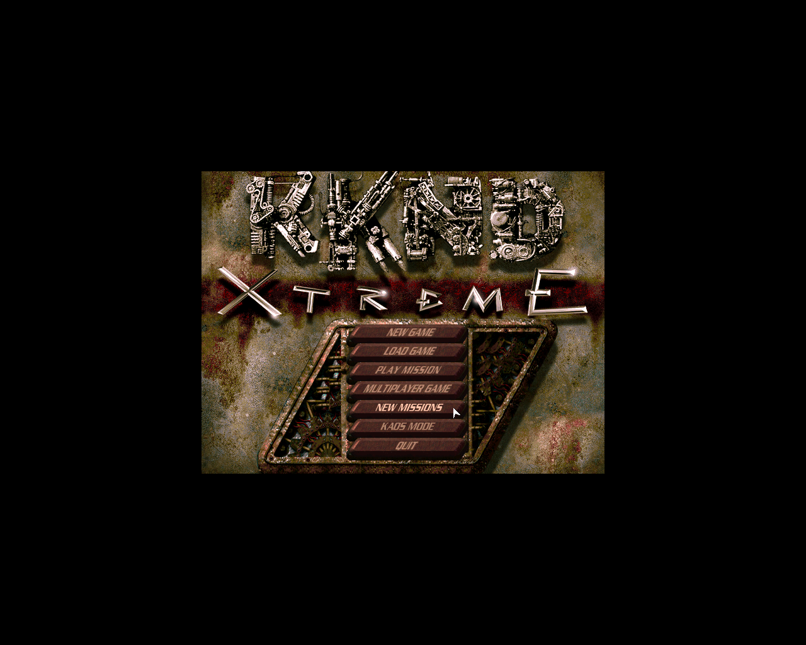
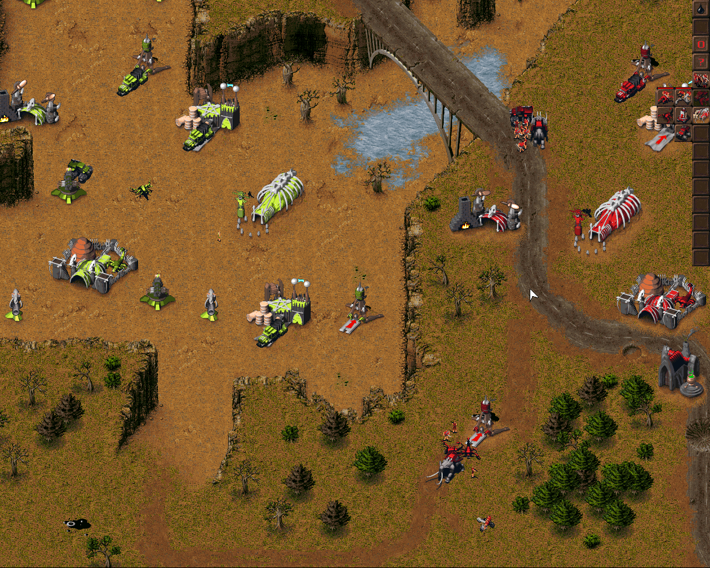

# OpenKKND (HD support)
Krush Kill 'N Destroy Xtreme remake based on original exe decompilation.
All features are working except multiplayer which is not tested.

- `master` branch — original game
- `hd_resolution` branch — HD resolution supported game

## Screenshots




# HD Resolution

### 🖥️ Supported Resolutions

The engine now supports any custom resolution.


### Configuration
Create `config.txt` in the game folder (same directory as `OpenKKND` executable) with any of the following options:

| Option | Description |
|---|---|
| `vga_resolution_width` | Resolution width |
| `vga_resolution_height` | Resolution height |
| `vga_fullscreen` | Fullscreen mode (1 = fullscreen, 0 = window mode) |

Example `config.txt`:

```
vga_resolution_width=1280
vga_resolution_height=1024
vga_fullscreen=1
```

# Build

Clone the repository and checkout the desired branch:

```sh
git clone <repo_url>
git checkout master
```

For HD resolution support use `hd_resolution` branch instead:

```sh
git checkout hd_resolution
```

## Windows (MSYS2 MINGW32)

1. Install [MSYS2](https://www.msys2.org/)
2. Open **MSYS2 MINGW32** (not MINGW64!)
3. Install dependencies:

```sh
pacman -Syu              # update (close terminal after, reopen MINGW32)
pacman -Su mingw-w64-i686-gcc mingw-w64-i686-SDL2 mingw-w64-i686-dsound make cmake git
```

4. Build:

```sh
cd /home/
git clone https://github.com/kresimirv/OpenKKND.git
cd OpenKKND
git checkout hd_resolution
rm -rf build
cmake -B build -S . -G "Unix Makefiles" \
  -DCMAKE_BUILD_TYPE=Release \
  -DWIN32=TRUE \
  -DSDL2_INCLUDE_DIR=/mingw32/include \
  -DSDL2_LIBRARY=/mingw32/lib/libSDL2.dll.a \
  -DSDL2_MAIN=/mingw32/lib/libSDL2main.a
cmake --build build -j$(nproc)
```

### Package

Copy `/bin/OpenKKND.exe` and all `.dll` files from `C:\msys64\mingw32\bin` to your KKnD installation folder.

Create `config.txt` file in the game directory to set your desired resolution (see [Configuration](#configuration)).

## Linux

### Build SDL2 (32-bit)
```sh
curl -L https://github.com/libsdl-org/SDL/releases/download/release-2.32.10/SDL2-2.32.10.tar.gz -o /tmp/SDL2-2.32.10.tar.gz
tar -xzf /tmp/SDL2-2.32.10.tar.gz -C /tmp
mkdir -p /tmp/SDL2-build && cd /tmp/SDL2-build
CFLAGS=-m32 CXXFLAGS=-m32 LDFLAGS=-m32 ../SDL2-2.32.10/configure --prefix=$HOME/.local/SDL2-install --libdir=$HOME/.local/SDL2-install/lib --host=i686-linux-gnu
make -j$(nproc)
make install
cd $HOME/.local/SDL2-install/lib && ln -sf libSDL2-2.0.so.0 libSDL2-2.0.so
```

### Build project
```sh
git clone https://github.com/kresimirv/OpenKKND.git
cd OpenKKND
git checkout hd_resolution
mkdir -p build && cd build
cmake .. -DCMAKE_BUILD_TYPE=Release -DSDL2_CUSTOM_PREFIX=$HOME/.local/SDL2-install
cmake --build . -j$(nproc)
cd ../bin && ./OpenKKND
```

### Package

Copy `/bin/OpenKKND` to your KKnD installation folder.

Create `config.txt` file in the game directory to set your desired resolution (see [Configuration](#configuration)).


## 🚀 Purpose

The goal of this repository is to modernize the original game experience by:

* Enabling higher resolutions
* Fixing UI issues that appear at larger screen sizes
* Preserving original gameplay and compatibility
* Keeping engine modifications lightweight and maintainable
